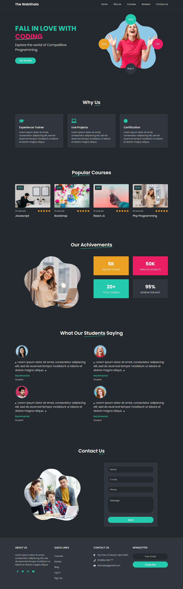

# Courses Landing Page

This template is designed to display courses and highlight the offerings of a course center. 
It features a fully responsive design, ensuring an optimal viewing experience across all devices.
Developed using HTML and CSS, the template utilizes media queries to adapt its layout and style for various screen sizes,
making it accessible and user-friendly on both desktop and mobile devices.

<!--## Preview
 
-->
## Features

- **Responsive Design:** Fully optimized for seamless viewing on all device sizes.
- **Countdown Timer:** Highlights upcoming events or promotions.
- **Section Animations:** Smooth scroll animations using AOS (Animate On Scroll).
- **Interactive Slider:** Showcases images or special offers with Owl Carousel.

## Technologies Used

- **HTML:** Provides the structure of the landing page.
- **CSS:** Styles the layout and design elements.

### Live Preview
  [Courses Landing Page](https://ahmedfarag18.github.io/courses-website)
